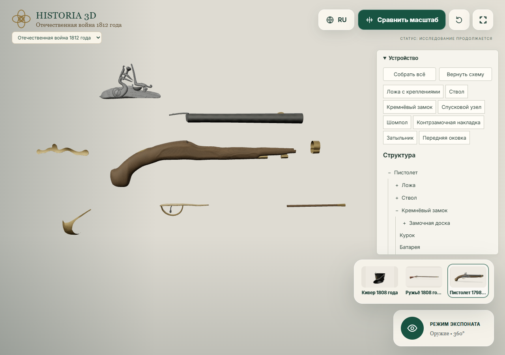
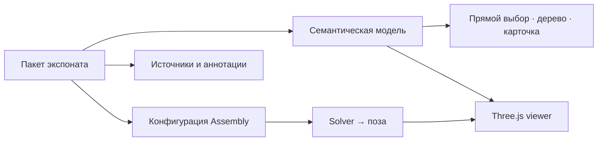

# HISTORIA 3D

<p><strong>Рассматривать предмет. Исследовать устройство. Проверять источники.</strong></p>

HISTORIA 3D — интерактивный музей исторических реконструкций. Здесь 3D-модель связана с описанием предмета, исследовательскими вопросами и свидетельствами, на которых основано её восстановление.

Проект помогает изучать историю через наблюдение: повернуть экспонат, выбрать деталь, раскрыть узел, сопоставить увиденное с источниками и понять, где заканчивается известное и начинается реконструкция.

[Быстрый старт](#быстрый-старт) · [Возможности](#возможности) · [Документация](docs/README.md) · [Добавить экспонат](docs/EXHIBIT_AUTHORING_GUIDE.md)



*Работающий интерфейс проекта: семантическая структура и схема разборки пистолета. Учебная композиция отделена от исторической модели предмета.*

## Возможности

| Направление | Что доступно |
| --- | --- |
| **Осмотр** | Свободное вращение, масштабирование, возврат ракурса и сравнение масштаба |
| **Прямой выбор** | Выбор поверхности пистолета в 3D, подсветка и синхронная карточка детали |
| **Структура предмета** | Семантическое дерево с управлением с клавиатуры; детали, узлы, области и признаки |
| **Assembly** | Общая схема пистолета, отдельное раскрытие замка и спусковой группы, изоляция и полупрозрачное окружение |
| **Исследование** | Вопросы наблюдения, аннотации, источники и явно обозначенная неопределённость |
| **Доступность** | Адаптивный интерфейс, мышь и touch, поддержка reduced-motion, русский и английский UI |

Семантическое взаимодействие и Assembly настроены для пистолета. Кивер и ружьё используют существующие точки исследования. Viewer принимает процедурную геометрию и GLB через общий контракт.

## Текущая коллекция

В review-интерфейсе открыт раздел **«Отечественная война 1812 года»**.

| Экспонат | Статус данных | Взаимодействие |
| --- | --- | --- |
| Кивер образца 1808 года, вариант 1810 года | `historical-review`; модель `DEV_ONLY` | Осмотр и точки исследования |
| Пехотное ружьё образца 1808 года | `reconstruction`; модель `DEV_ONLY` | Осмотр и точки исследования |
| Кавалерийский пистолет 1798/1804 гг. | `reconstruction` | Прямой выбор, структура и Assembly |

Пакеты Покрова на Нерли и шлема Ивана IV сохранены для дальнейшей работы, но исключены из активного каталога. Стартовый экспонат — кивер.

> **Статус проекта: исследовательская review-версия.** Техническая проверка модели не заменяет историческую экспертизу. Production-сборка отдельно проверяет готовность содержимого к публикации.

## Быстрый старт

Нужны Node.js **20.19+ в ветке 20** либо **22.12+** и npm. Для осмотра модели — браузер с WebGL2.

```bash
git clone https://github.com/resarytrew/history3D.git
cd history3D
npm ci
npm run dev
```

Откройте адрес, который выведет Vite. Для прямого перехода к пистолету добавьте к нему:

```text
/?exhibit=russian-pistol-1798-1804
```

Сборка и локальный просмотр:

```bash
npm run build
npm run preview
```

`build` создаёт review-сборку в `dist/`. `build:production` применяет строгую проверку публикации и с текущими исследовательскими записями ожидаемо завершается ошибкой. [Подробная установка и команды →](docs/GETTING_STARTED.md)

## Архитектурный принцип

**`part-of` описывает предмет; `Exhibit.assembly` описывает способ его исследования.**

Исторический узел и удобная визуальная группировка — разные сущности. Схема может перемещать спусковой крючок и скобу вместе, сохраняя их самостоятельными частями предмета в семантическом дереве.



Приложение статическое: **React 19 · TypeScript · Three.js · Vite · Zod**. Backend и база данных для текущего запуска не требуются. Проверки используют **Vitest**, **Testing Library** и **Playwright**.

[Архитектура →](docs/ARCHITECTURE.md) · [Контракты данных →](docs/CONTENT_SCHEMA.md) · [Семантика и Assembly →](docs/SEMANTIC_ASSEMBLY.md)

## Проверки

```bash
npm run lint
npm run typecheck
npm run validate:content
npm test -- --maxWorkers=2 --hookTimeout=120000
```

На проверенном срезе от **10 сентября 2026**: 84 успешных unit/integration-теста и 9 известных падений; профильные браузерные сценарии — 10/10. Падения связаны с ожиданиями скрытой коллекции и прежним лимитом геометрии пистолета. Они зафиксированы по именам и причинам, а не только по количеству.

[Как запускать проверки и сравнивать baseline →](docs/TESTING.md) · [Отчёт проверенного среза →](docs/ASSEMBLY_V2_VERIFICATION.md)

## Документация

| Для кого | С чего начать |
| --- | --- |
| Знакомство с проектом | [Видение и границы продукта](docs/PRODUCT_VISION.md) |
| Разработка | [Запуск](docs/GETTING_STARTED.md), [архитектура](docs/ARCHITECTURE.md), [проверки](docs/TESTING.md) |
| Автор экспоната | [Руководство автора](docs/EXHIBIT_AUTHORING_GUIDE.md), [подготовка моделей](docs/MODEL_PIPELINE.md) |
| Исследователь | [Политика достоверности](docs/HISTORICAL_ACCURACY_POLICY.md), [workflow реконструкции](docs/RECONSTRUCTION_WORKFLOW.md) |
| Развитие проекта | [Дорожная карта](docs/ROADMAP.md) |

Полный указатель, спецификации и архивы проверок — в [документации проекта](docs/README.md).

## Лицензия и происхождение материалов

Код распространяется по [MIT](LICENSE). Источники, модели, изображения и аудио учитываются отдельно в пакетах экспонатов и записях авторства; лицензия кода не заменяет проверку прав на сторонние материалы.

Исторические сведения сопровождаются источниками. Генеративные инструменты и визуальная убедительность модели сами по себе не являются историческим свидетельством.
